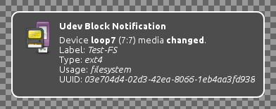

udev-block-notify
=================

**Notify about udev block events**

This runs in background and produces notifications whenever udev (or systemd)
receives an event about a block device. Notifications look like this:

Requirements
------------

To compile and run `udev-block-notify` you need:

* [libnotify](http://library.gnome.org/devel/notification-spec/)
* [systemd](http://www.freedesktop.org/wiki/Software/systemd) (or `udev` which has been merge into `systemd`)
* [markdown](http://daringfireball.net/projects/markdown/) (HTML documentation)

Some systems may require additional development packages for the libraries.
Look for `systemd-devel`, `libudev-devel` or similar.

Build and install
-----------------

Building and installing is very easy. Just run:

> make

followed by:

> make install

This will place an executable at `/usr/bin/udev-block-notify`,
documentation can be found in `/usr/share/doc/udev-block-notify/`.
Additionally a desktop file is installed to `/etc/xdg/autostart/`, this
automatically starts the program when logged in to a desktop environment.

Usage
-----

Just run `udev-block-notify` after installation or re-login to desktop
environment for autostart.
