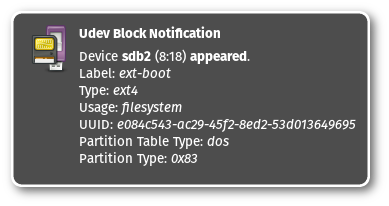
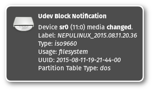

udev-block-notify
=================

**Notify about udev block events**

This runs in background and produces notifications whenever udev (or systemd)
receives an event about a block device. Notifications look like this:

Or for optical media:

These are just examples, it shows information about every block device.

Requirements
------------

To compile and run `udev-block-notify` you need:

* [systemd](https://www.github.com/systemd/systemd)
* [libnotify](https://developer.gnome.org/notification-spec/)
* [markdown](https://daringfireball.net/projects/markdown/) (HTML documentation)
* `gnome-icon-theme` and `gnome-icon-theme-extras` (or anything else that includes the required media icons)

Some systems may require additional development packages for the libraries.
Look for `libnotify-devel`, `systemd-devel`, `libudev-devel` or similar.

Build and install
-----------------

Building and installing is very easy. Just run:

> make

followed by:

> make install

This will place an executable at `/usr/bin/udev-block-notify`,
documentation can be found in `/usr/share/doc/udev-block-notify/`.
Additionally a systemd unit file is installed to `/usr/lib/systemd/user/`.

Usage
-----

Just run `udev-block-notify` to run it once. A systemd user service can be
started and/or enabled with `systemctl --user start udev-block-notify`
or `systemctl --user enable udev-block-notify`.

License and warranty
--------------------

This program is free software: you can redistribute it and/or modify
it under the terms of the GNU General Public License as published by
the Free Software Foundation, either version 3 of the License, or
(at your option) any later version.

This program is distributed in the hope that it will be useful,
but WITHOUT ANY WARRANTY; without even the implied warranty of
MERCHANTABILITY or FITNESS FOR A PARTICULAR PURPOSE.  See the
[GNU General Public License](COPYING.md) for more details.

### Upstream

URL:
[GitHub.com](https://github.com/eworm-de/udev-block-notify#udev-block-notify)

Mirror:
[eworm.de](https://git.eworm.de/cgit.cgi/udev-block-notify/)
[GitLab.com](https://gitlab.com/eworm-de/udev-block-notify#udev-block-notify)
